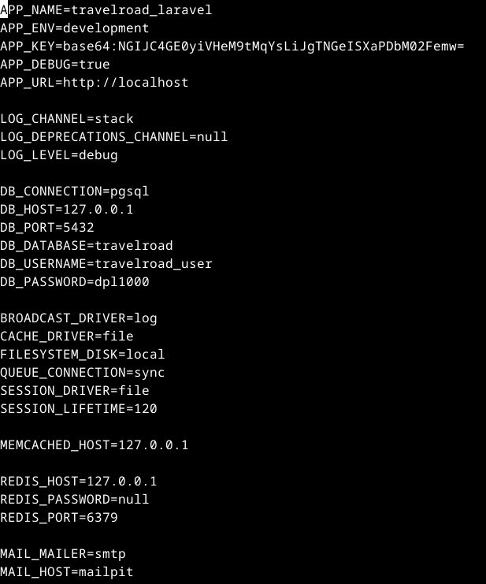

# ÍNDICE

+ [Material empleado](#id1)
+ [Desarrollo](#id2)

# ***Material empleado***. <a name="id1"></a>

- Nginx
- PHP
- Composer
- PostgreSQL + datos
- pgAdmin

## ***Desarrollo***. <a name="id2"></a>

Creamos el proyecto con: composer create-project laravel/laravel travelroad_laravel
Esto tendrá que generar un .gitignore y un .env con una app_key (En caso de que no, generarlo manualmente)
Cambiamos el .env quedando con el siguiente contenido:

Cambiamos los permisos del storage para el usuario nginx usando:  
``` sudo chgrp -R nginx storage bootstrap/cache ```  
``` sudo chmod -R ug+rwx storage bootstrap/cache ```

