# ÍNDICE

+ [Material empleado](#id1)
+ [Desarrollo](#id2)

# ***Material empleado***. <a name="id1"></a>

- Nginx
- PHP
- Composer
- PostgreSQL + datos
- pgAdmin
- CertBot

## ***Desarrollo***. <a name="id2"></a>

Creamos el proyecto con: composer create-project laravel/laravel travelroad_laravel (En mi caso lo cree dentro de un repositorio en el home de mi usuario y luego lo moví a /usr/share/nginx)  
Esto tendrá que generar un .gitignore y un .env con una app_key (En caso de que no, generarlo manualmente)
Cambiamos el .env quedando con el siguiente contenido:  

  

Cambiamos los permisos del storage para el usuario nginx usando:  
``` sudo chgrp -R nginx storage bootstrap/cache ```  
``` sudo chmod -R ug+rwx storage bootstrap/cache ```
Cambiamos las vistas llendo a resources/views, dicho directorio tiene el siguiente contenido:  

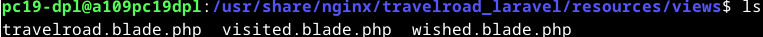  

Las vistas tienen el siguiente contenido:  
travelroad.blade.php:  
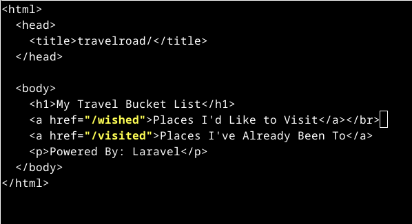  
visited.blade.php:  
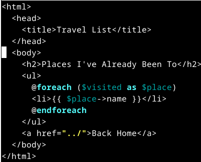  
wished.blade.php:  
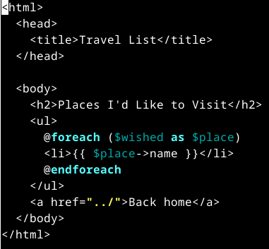  

Volvemos a la raíz del proyecto y cambiamos routes/web.php con el siguiente contenido:  
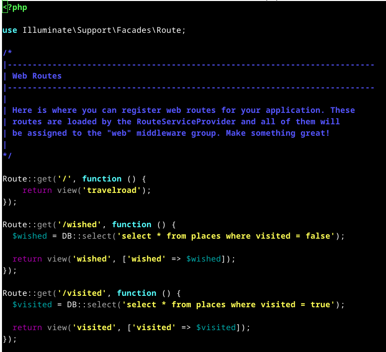  

Creamos travelroad_laravel.conf en /etc/nginx/conf.d con el siguiente contenido:  
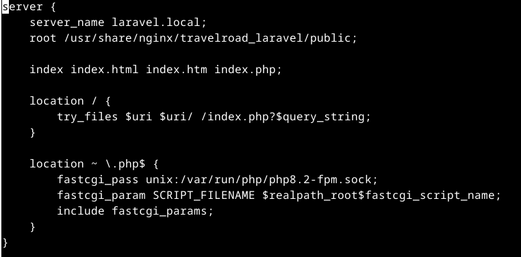  

Creamos un script para conectarse y actualizar la máquina de producción:
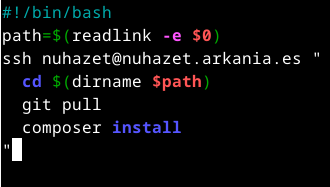  

En la máquina de producción bajamos y movemos a la ruta correspondiente el repositorio, creamos un .env a partir del .env.example modificando los valores por los que queramos usar en producción y generamos una app_key con ``` php artisan key:generate ```, creamos el .conf con el server_name "laravel.nuhazet.arkania.es", hacemos un cambio en desarrollo (añadimos - Changed al h1 de la vista travelroad) y ejecutamos el script. Nos conectamos para comprobar que todo funciona:  
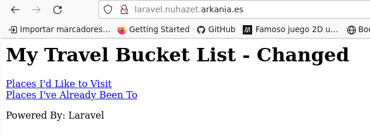  

Ahora agregamos el certificado usando certbot ``` sudo certbot --nginx ``` y seleccionamos el número que corresponda a laravel.nuhazet.arkania.es. Luego creamos otro .conf para la redireccion www con el siguiente contenido:  
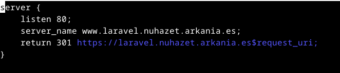  
y le agregamos el certbot ejecutando el mismo comando pero seleccionando el número correspondiente.
Quedaría tal que así:  
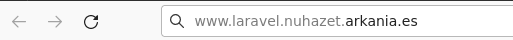  
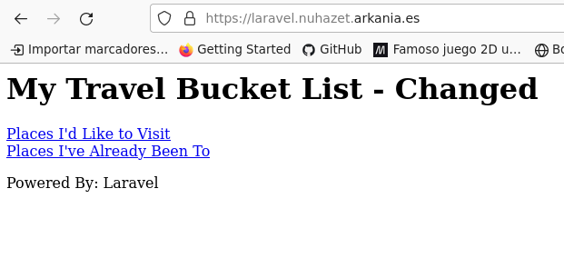  
